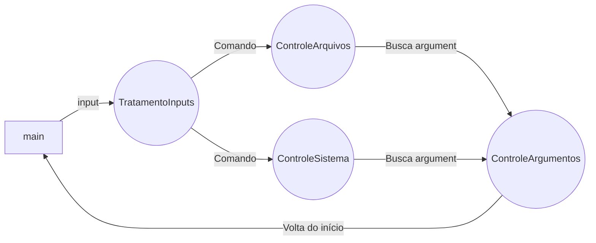

# Python Bash/Shell terminal

Terminal de CLI usando python.

**Bibliotecas utilizadas**

 - os (Controle de arquivos do sistema)
 - shutil (comandos manipulação de arquivos)

**

## Comandos disponíveis

 1. **criardiretorio nome_diretorio** - - - > cria um diretório
 2. **removerpasta nome_pasta** - - - > remove um diretório
 3. **removerarquivo nome_arquivo** - - - > remove um arquivo
 4. **criararquivo nome_arquivo** - - - > cria um arquivo
 5. **listar caminho** - listar os dados de um diretório ou do diretório atual
 6. **localatual**  - - -> mostra aonde você está
 
 ## 

## Argumentos disponíveis

 - **-i** - - - > Faz uma pergunta a ser respondida se deseja realmente executar o comando
 - **-d** - - - > Faz alguns comandos como o criardiretorio a serem executados recursivamente, ignorando todos erros a fim de completa-lo
 - 

**

# Arquivos
**main.py**
início do programa, faz inicialização dos outros módulos

**TratamentoInputs.py**
Bloco do código responsável por receber os inputs do usuários e separar cada parte do input como uma função, comando, parametros e argumentos

**ControleSistema.py**
Arquivo que armazena as funções que interagem diretamente com o sistema, como manipulação de navegação e localização

**ControleArquivos.py**
Arquivo que armazena as funções que interagem diretamente com a manipulação de arquivos

**ControleArgumentos.py**
Arquivo que armazena as funções criam a interação dos comandos e programas com os argumentos

